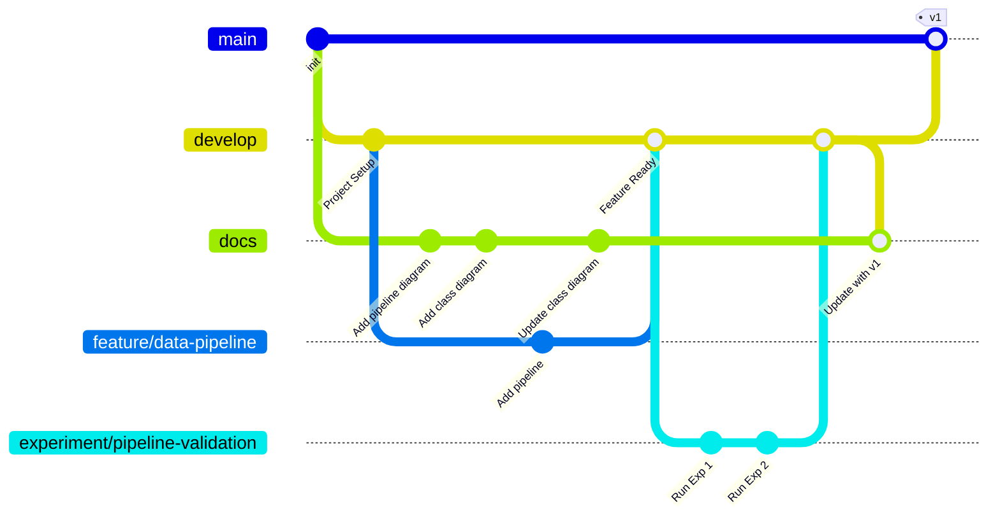

Praca Inżynierska Stefan Bogdan

PWr Semestr Zimowy 2025/26

Opiekun dr. hab. inż. Michał Woźniak

Branch: **docs**

Description: **dokumentacja i diagramy**

```mermaid
gitGraph
    commit id: "init"
    branch develop
    checkout develop
    commit id: "Project Setup"

    checkout main
    branch docs
    checkout docs
    commit id: "Add pipeline diagram"
    commit id: "Add class diagram"

    checkout develop
    branch feature/data-pipeline
    checkout feature/data-pipeline
    commit id: "Add pipeline"
    checkout docs
    commit id: "Update class diagram"

    checkout develop
    merge feature/data-pipeline id: "Feature Ready"

    branch experiment/pipeline-validation
    checkout experiment/pipeline-validation
    commit id: "Run Exp 1"
    commit id: "Run Exp 2"
    
    checkout develop
    merge experiment/pipeline-validation

    checkout docs
    merge develop id: "Update with v1"
    
    checkout main
    merge develop tag: "v1"
```